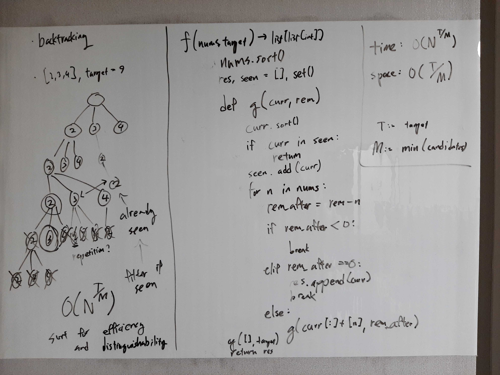

[Problem](https://leetcode.com/problems/combination-sum/)

## takeaway
- Backtracking = DFS + variable-ordering + fail-on-violation
- Sorting an array can yield provide an earlier point of fail-on-violation.
- Instead of using a `seen` set, we can prevent duplicates from occuring by not
  using the elements we've already used up, e.g. after using 2 to and moving
  on to 3, we will not produce `[3, 2]` if we just simply don't use 2 anymore.
- Avoid making copies if possible to save computation and space.

## take 1

- code:
```python
def combination_sum(self, nums: list[int], target: int) -> list[list[int]]:
    def backtrack(curr: list[int], rem: int) -> None:
        curr.sort()
        if tuple(curr) in seen:
            return
        seen.add(tuple(curr))
        if rem == 0:
            res.append(curr)
        elif rem > 0:
            for n in nums:
                backtrack(curr[:] + [n], rem - n)
    nums.sort()
    res, seen = list(), set()
    backtrack([], target)
    return res
```
- Result
    - Accepted
- Note
    - Not enforcing fail-on-violation.

## take 2
- code:
```python
def combination_sum(self, nums: list[int], target: int) -> list[list[int]]:
    def backtrack(curr: list[int], rem: int) -> None:
        curr.sort()
        if tuple(curr) in seen:
            return
        seen.add(tuple(curr))
        if rem == 0:
            res.append(curr)
        elif rem > 0:
            for n in nums:
                if (rem - n) < 0:
                    break
                backtrack(curr[:] + [n], rem - n)
    nums.sort()
    res, seen = list(), set()
    backtrack([], target)
    return res
```
- Result
    - Accepted
- Note
    - By sorting `nums`, we can fail faster by breaking out of the loop that
      will yield `n` values will overshoot the target.

## take 3
- code:
```python
def combination_sum(self, nums: list[int], target: int) -> list[list[int]]:
    def backtrack(curr: list[int], rem: int, i: int) -> None:
        if rem == 0:
            res.append(curr)
        elif rem > 0:
            for j in range(i, len(nums)):
                n = nums[j]
                if (rem - n) < 0:
                    break;
                backtrack(curr[:] + [n], rem - n, j)
    nums.sort()
    res = []
    backtrack([], target, 0)
    return res
```
- Result
    - Accepted
- Note
    - Instead of using a `seen` set to filter out duplicates, we can just not
      backtrack with the elements we've already used up to prevent the
      duplicates from occurring in the first place.
    - Note that space complexity is still O((T/M)^2), since there are O(T/M)
      stack frames, each of which needs a copy of `curr`, which also has space
      complexity of O(T/M).

## take 4
- code:
```python
def combination_sum(self, nums: list[int], target: int) -> list[list[int]]:
    def backtrack(curr: list[int], rem: int, i: int) -> None:
        if rem == 0:
            res.append(curr[:])
        elif rem > 0:
            for j in range(i, len(nums)):
                n = nums[j]
                if (rem - n) < 0:
                    break
                curr.append(n)
                backtrack(curr, rem - n, j)
                curr.pop()
    nums.sort()
    res = []
    backtrack([], target, 0)
    return res
```
- Result
    - Accepted
- Note
    - Instead of copying `curr` for each backtrack call, we can append and pop
      `n` before and after each call, and only copy `curr` when appending to
      `res`.
    - Now the space complexity if down to O(T/M).

